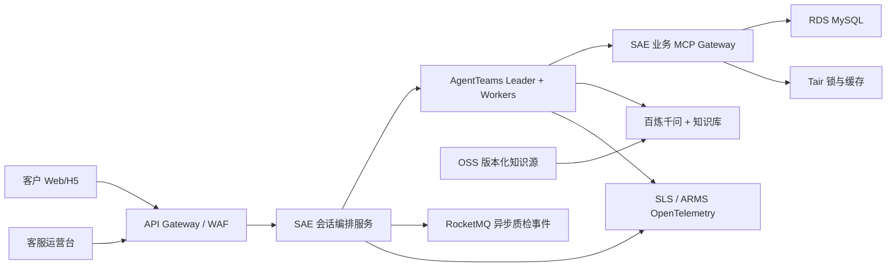

# 回声智能生产级 MVP 实现说明

## 1. 已实现范围

- Web/H5 客户端：需求表单、聊天、证据化方案、实时可用标记、锁库、草稿单和支付模拟。
- 运营台：人工接管队列、接管包、Copilot 推荐话术、人工编辑发送、知识提案、回测和审计。
- 后端：版本化状态机、幂等、防超卖、报价/锁定 TTL、PII 脱敏、风险分流和统一响应信封。
- Agent 资产：一个 Leader、需求诊断、推荐、履约、质检知识、人工客服 Copilot 五个 Worker，以及七个 Skill。

退款、改价和知识发布不提供给 Agent。支付页面只是回调模拟器。

## 2. 运行架构

本地实现将 APP、Team 和 MCP 合并进单进程，使用内置 SQLite；模块边界、工具名和数据契约保持与生产部署一致。

## 3. 人工接管与 Copilot

接管发生后，系统保存不可变接管任务，并立即生成三类话术：安抚确认、政策说明和行动导向。每条建议包含置信度、证据、风险提示和下一步。

Copilot 只绑定 `get_product_detail`、`check_availability`、`get_policy`、`get_order_status` 等只读工具。运营台不会自动发送建议；人工可选择、编辑并确认。最终消息记录 `human_approved=true`、采用的建议 ID 和是否编辑。未经审批的退款或赔偿承诺会被回复守卫拦截。

人工解决任务后，质检 Agent 只生成 `PENDING_APPROVAL` 知识提案；运营人员检查 Diff 和回测后才能批准。

## 4. 生产替换点

|本地模块|生产实现|保持不变|
|---|---|---|
|SQLite Repository|RDS MySQL；锁表迁移到 Tair|实体、状态、幂等键|
|MockBusinessMcpGateway|SAE MCP Gateway，接商户/库存/报价/订单 API|工具名、JSON Schema、错误码|
|本地规则 Agent|AgentTeams Worker + 百炼千问|共享上下文、Skill、权限边界|
|本地证据数据|OSS 连接器 + 百炼知识库混合检索/Rerank|EvidenceBundle|
|本地审计表|SLS + ARMS OTel|`trace_id` 和审计字段|

AgentTeams 当前账号的外部 Team 接入端点需要在部署第一周验证。服务侧保留统一会话 API；若目标账号只开放 Element UI，比赛演示先使用 Element UI 验证 Team，同时 H5 保持本地/百炼适配器，待受支持端点开放后替换运行时适配。

## 5. 安全与数据规则

- 生产、测试使用独立 AgentTeams 实例、数据库和知识库；所有查询携带 `tenant_id`。
- 用户原文不可变保存，但传入模型、Copilot 和知识治理前使用脱敏副本。
- 商户文档属于不可信输入，只能提供事实证据，不能改变工具权限和系统规则。
- 报价默认 60 秒有效，库存锁定 15 分钟；确认使用状态版本和幂等键。
- 写工具不得自动重试；只读工具最多重试两次，连续失败转人工。
- 改价、退款、知识发布和权限修改必须在应用服务中由人工身份完成。

## 6. 部署步骤

1. 在 AgentTeams 创建生产/测试实例、模型、Team 和 Worker；复制 `agentteams/` 中角色文件并上传已审核 Skill。
2. 将 `contracts/mcp-openapi.yaml` 对应的业务服务部署到 SAE，通过 AgentTeams HTTP-to-MCP 导入并启用认证。
3. 建立 RDS、Tair、RocketMQ、OSS 和百炼知识库；将机密放入 KMS/SAE Secret。
4. 构建本仓库容器并部署 SAE，API Gateway 配置登录鉴权、限流、WAF 和 HTTPS。
5. 应用服务与 MCP Gateway 上报 OTel 到 ARMS，业务与知识检索日志进入 SLS。
6. 执行自动化测试和四条演示链路；生产发布前把测试令牌和模拟支付入口关闭。

## 7. 验收证据

当前自动化测试覆盖需求澄清、证据引用、幂等、过期报价、防超卖、人工接管、Copilot 人工确认、危险承诺拦截、提示注入防护和知识审批。比赛材料应补充：AgentTeams Team 截图、单条完整 Trace、SLS 查询结果、四条链路录屏以及 150 条黄金集评测报告。
